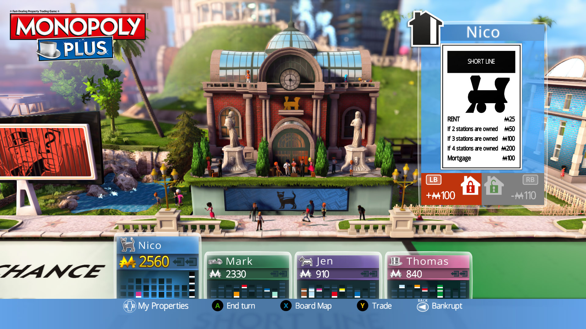

<h1>In-game Player UI</h1>

The player UI of a game has to be top 3 most important features for a game. It allows the player to interact with all the game has to offer. A UI should be slick but smart. The best player UIs are the ones that have features that feel natural to the player as well as not being tedious to interact with.

Utilising the gameplay loops I designed, see 'Gameplay_Loops' github repository, I can get a good idea of some of the functions that are needed for the player to access in the UI. In addition to my gameplay loop designs, like all of my designs for this project I looked at the PS4 monopoly game for a starting place and general direction, see below.

The first thing I notice is the options bar. It shows the available options for the player as well as how to access them. Without this options bar the player wouldn't be able to progress through the game and so it is of most importance.

The second thing I notice is the players status, we see all four players current money and the property they currently own. An important thing to note is that the game doesn't need this to be playable, but it serves to show the player all the relevant information, which is in my opinion just as important as the options bar.

The Last thing to note is the top right corner, the players whose go it is and the square they are currently on, same as the above paragraph this information isn't _needed_ but is greatly appreciated by the player.

<h2>My Player UI Design</h2>

My player UI design is very similar to the ps4 monopoly version seen above, this is because it is a well done UI and changing an aspect didn't seem worth to me.

I had thought about putting the options bar at the top of the screen however since we don't have a full idea on our implementation I thought that it was the most risk-averse placement. In addition to the options bar the player information is also designed in a similar way, once again because I believe the ps4 version to have done a good job but I didn't decide to include the part where you can see what properties the players have. I decided to cut this out because our implementation may display said information and so it wouldn't make sense.

<h2>Work in Progress</h2>

All the decisions that went into the my design are not final, if a situation arises where an options bar at the top is most reasonable or our implementation doesn't display the players owned properties well then my design will be changed. With this design I hope to provide a starting point and relative direction for my team.
